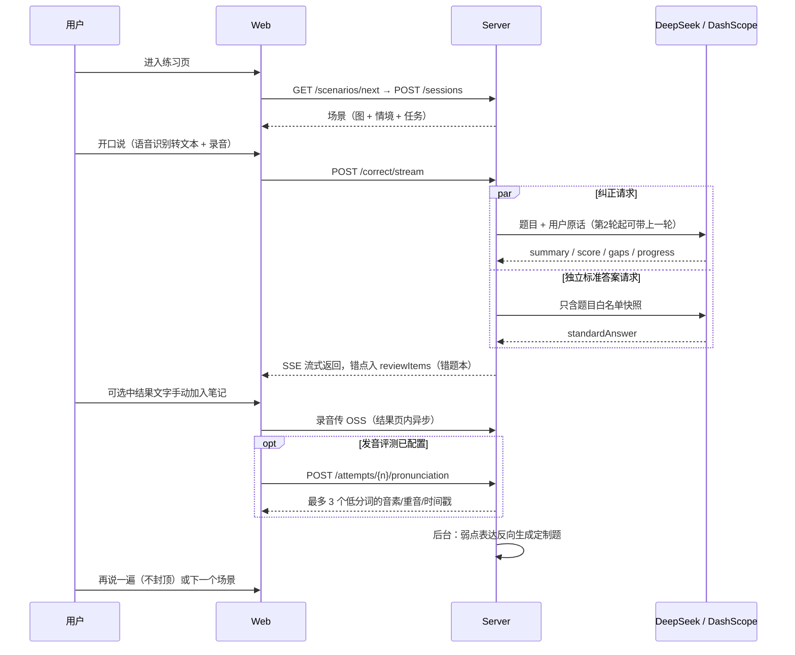

# SpeakUp 文档入口与代码架构

本文件是全部文档的导航入口。图一律用 mermaid 文本画，不放二进制图片。业务流程详见 [design/场景练习/scenario-mode.md](design/场景练习/scenario-mode.md)。

## 目录结构

```
docs/
├── README.md            # 本文件：导航 + 代码架构
├── changelog/           # 每次修改一个 markdown 文件（<YYYYMMDD-HHMMSS>-<名字>.md，只增不改，见 changelog/README.md）
├── 业务/                # 当前已实现行为的分模块文档（含结果页与发音评测）
├── design/              # 数据模型 + 设计稿
│   ├── schema.md / ids.md / storage.md / spec.md   # 跨模块基础
│   ├── 场景练习/        # 场景模式/分类/混合练习/题目评测
│   └── 发音纠正/        # 发音纠正产品与实施方案（三层分工/模式选择/A-B 路线）
├── 评测/                # 评测方法 + 发音纠正选型调研
├── 原型设计/            # UI 设计稿画布原型（SpeakUp.html，非运行代码）
├── 脚本说明.md          # scripts/ 与 server/scripts/ 用途
├── deploy.md            # 部署指南
└── langfuse.md          # Langfuse 自托管与埋点
```

## 文档地图

按主题查找文档：

| 位置 | 内容 | 维护约定 |
|------|------|---------|
| `docs/业务/*.md` | **当前已实现**行为的分模块文档（错题本与复习、用户反馈、自由录入、历史与分享、主题设置、账户资料） | 每次行为变更必须同步更新 |
| `docs/design/schema.md` | MongoDB 集合字段（数据模型事实源） | 字段变更必须同步 |
| `docs/design/*.md` | 跨模块基础（schema/ids/storage/spec） | 落地后回写进展 |
| `docs/design/场景练习/*.md` | 场景模式总览 / 公共题分类 / 混合练习 / 题目评测 | 场景链路变化时同步 |
| `docs/评测/*.md` | 评测方法、模型横评基线、发音纠正选型调研 | 跑完横评/调研后回写 |
| `docs/changelog/*.md` | 每次修改一个文件（北京时间秒级命名；小改动几行、大功能补背景/权衡/验证，只增不改） | 每次改动必须追加 |
| `docs/原型设计/` | UI 设计稿画布原型（SpeakUp.html） | — |
| `docs/脚本说明.md` | scripts/ 与 server/scripts/ 各脚本用途 | 脚本增删时同步 |
| `docs/deploy.md` | 部署指南（架构 / 首次部署 / 回滚 / 运维命令） | 部署形态变化时同步 |
| `docs/langfuse.md` | Langfuse 自托管部署、埋点与踩坑记录 | 部署/埋点变化时同步 |
| `server/evals/README.md` | 评测集跑法 / 任务文件格式 / Langfuse 回写 | evals 代码变化时同步 |
| `CONTRIBUTING.md` | 开发流程 / 测试分层 / CHANGELOG 格式（人 + agent 共用） | 流程变化时同步 |
| `AGENTS.md` | AI agent 入口：代码地图 / 敏感信息约定 / 部署运维 | 结构变化时同步 |

## 系统架构图


## API 端点

| 路由 | 方法 | 说明 | 依赖 |
|------|------|------|------|
| `/api/auth/login` | POST | 手机号登录/注册 | MongoDB |
| `/api/auth/profile` | PATCH | 鉴权后修改当前用户昵称 | MongoDB |
| `/api/scenarios/next` | GET | 派题：定制题 > 未练公共题 > 轮换 | MongoDB + OSS 签名 |
| `/api/scenarios/practice-word` | POST | 「用这个词练一题」即时出定制场景题 | 文本模型 + 文生图 |
| `/api/practice-sessions` | GET/POST | 创建会话（存场景快照）/ 历史列表；`/{pid}` 读单条 | MongoDB |
| `/api/practice-sessions/{pid}/recording` | POST | 上传录音，关联本轮 attempt，并告知发音评测是否启用 | OSS |
| `/api/practice-sessions/{pid}/attempts/{n}/pronunciation` | POST | 对已关联录音做口语发音评测；已有完成结果幂等返回 | 腾讯智聆 + OSS + MongoDB |
| `/api/practice-sessions/{pid}/share` | POST/DELETE | 开启/取消分享（token 幂等复用） | MongoDB |
| `/api/share/{token}` | GET | 公开读取已分享的练习结果（无鉴权） | MongoDB + OSS 签名 |
| `/api/correct` `/api/correct/stream` | POST | AI 评估（流式 SSE），错点自动进错题本 | 文本模型 + MongoDB |
| `/api/correct/chat/stream` | POST | 针对本轮反馈的 coach 追问（SSE） | 文本模型 |
| `/api/transcribe` | POST | 录音转写 | 百炼 Qwen ASR |
| `/api/tts` | POST | 文本转自然语音并缓存到 OSS | 百炼 Qwen TTS + OSS |
| `/api/review-items` | GET/POST | 错题本（错题 mistake / 好表达笔记 note）；收纳/恢复/惰性翻译等子路由见 [业务/1-错题本与复习.md](业务/1-错题本与复习.md) | MongoDB（translate 另走文本模型） |
| `/api/feedbacks` | POST/GET | 用户反馈（练习结果点赞踩 + 全局反馈），带 AI 反馈快照 | MongoDB |
| `/api/free-topics/next` | GET | 自由说抽题：抽一个该用户没说过的话题，池子用完自动调 LLM 补一批 | MongoDB（补题走文本模型） |
| `/api/health` | GET | 健康检查 | — |
| `/api/version` | GET | 只读版本探针：返回版本号与状态，不依赖数据库或外部服务 | — |

## 数据流（一次练习）


