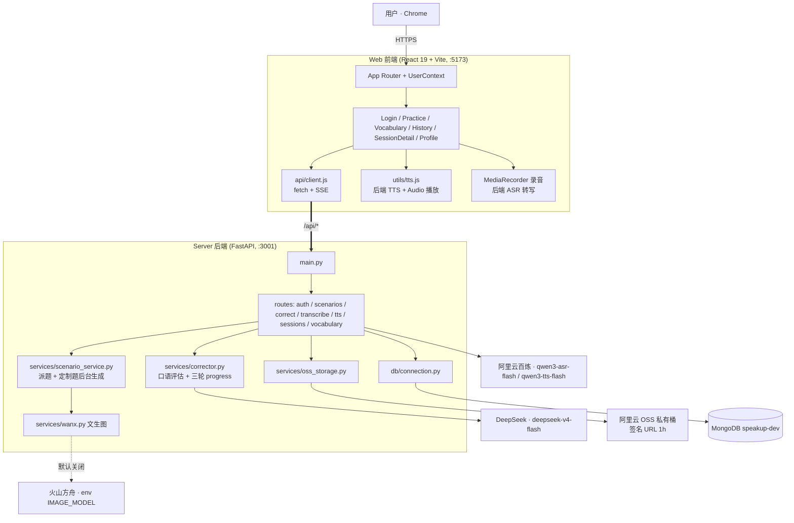
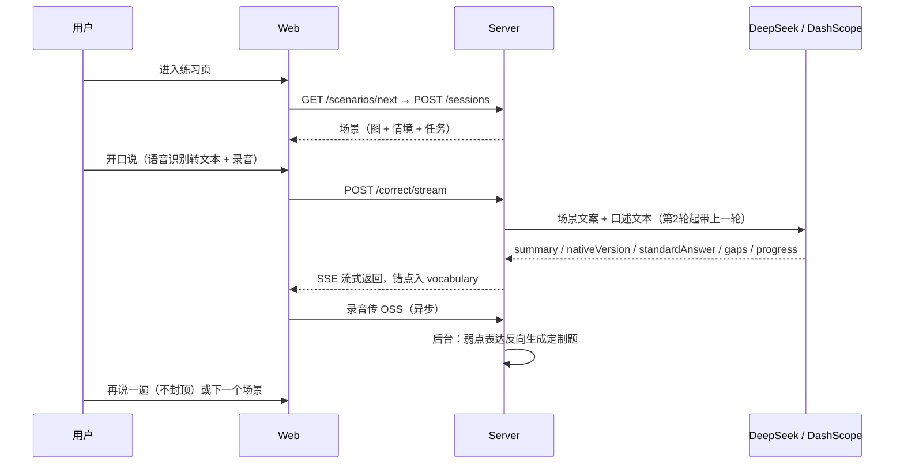

# SpeakUp 代码架构

图一律用 mermaid 文本画，不放二进制图片。业务流程详见 [design/scenario-mode.md](design/scenario-mode.md)。

## 系统架构图

## API 端点

| 路由 | 方法 | 说明 | 依赖 |
|------|------|------|------|
| `/api/auth/login` | POST | 手机号登录/注册 | MongoDB |
| `/api/scenarios/next` | GET | 派题：定制题 > 未练公共题 > 轮换 | MongoDB + OSS 签名 |
| `/api/sessions` | GET/POST | 创建会话（存场景快照）/ 历史列表 | MongoDB |
| `/api/sessions/{id}/recording` | POST | 上传录音，关联本轮 attempt | OSS |
| `/api/correct` `/api/correct/stream` | POST | AI 评估（流式 SSE），错点自动进复习 | 百炼文本模型 + MongoDB |
| `/api/transcribe` | POST | 录音转写 | 百炼 Qwen ASR |
| `/api/tts` | POST | 文本转自然语音并缓存到 OSS | 百炼 Qwen TTS + OSS |
| `/api/vocabulary` | GET/POST/PUT/DELETE | 错题本 + SM-2 间隔重复 | MongoDB |

## 数据流（一次练习）

