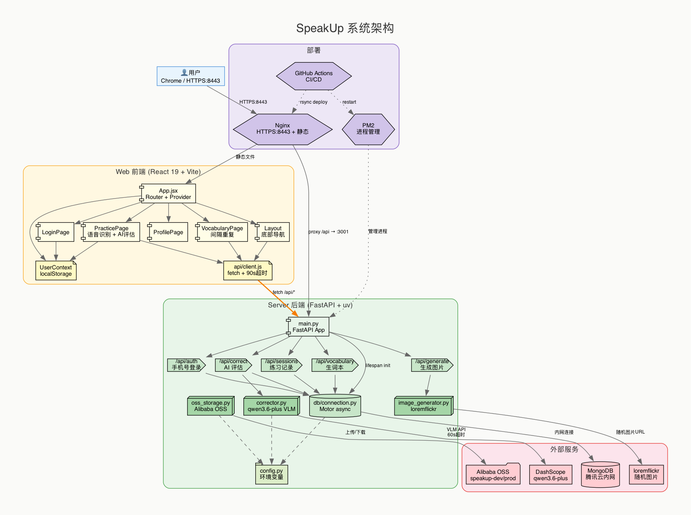
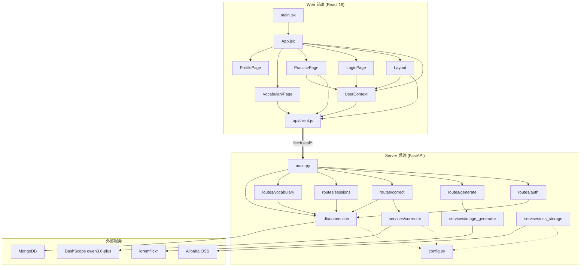

# SpeakUp 代码架构

## 系统架构图



## 模块依赖关系



## API 端点

| 路由 | 方法 | 说明 | 依赖 |
|------|------|------|------|
| `/api/auth/login` | POST | 手机号登录/注册 | MongoDB |
| `/api/generate` | POST | 生成练习图片 | loremflickr |
| `/api/correct` | POST | AI 评估口语 | DashScope VLM + MongoDB |
| `/api/sessions` | GET/POST | 练习记录 CRUD | MongoDB |
| `/api/vocabulary` | GET/POST/PUT/DELETE | 生词本 + 间隔重复 | MongoDB |

## 数据流

```
用户打开页面 → HTTPS:8443 → Nginx → 静态文件(React SPA)
     ↓
用户登录 → /api/auth/login → MongoDB(users)
     ↓
开始练习 → /api/generate → loremflickr 随机图片
     ↓
看图说英语 → Chrome SpeechRecognition → 文本
     ↓
提交评估 → /api/correct → DashScope qwen3.6-plus(看图+听文本)
     ↓                          ↓
     ↓                   返回: summary + nativeVersion + gaps[]
     ↓
保存到 sessions.attempts[] (MongoDB)
     ↓
用户收藏生词 → /api/vocabulary → 间隔重复复习
```
