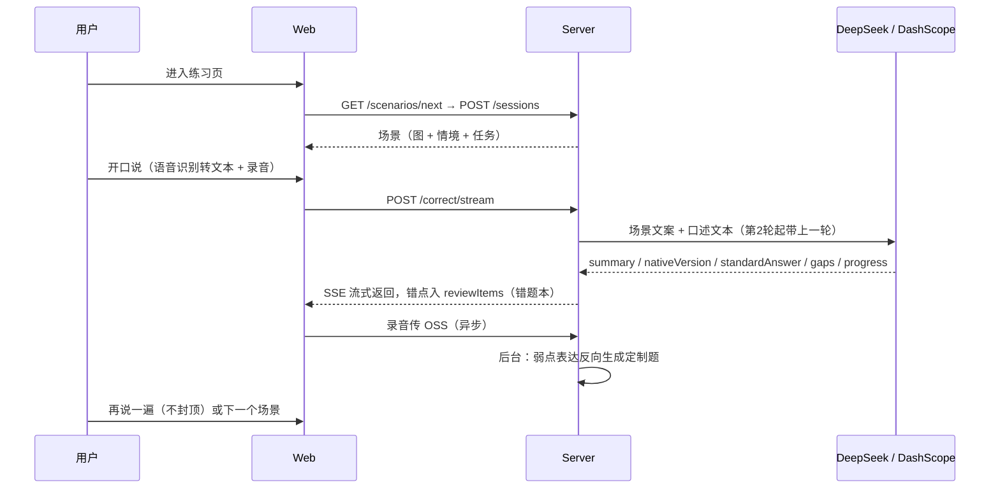

# SpeakUp 代码架构

图一律用 mermaid 文本画，不放二进制图片。业务流程详见 [design/scenario-mode.md](design/scenario-mode.md)。

## 文档地图

| 位置 | 内容 | 维护约定 |
|------|------|---------|
| `docs/业务/*.md` | **当前已实现**行为的分模块文档（错题本与复习等） | 每次行为变更必须同步更新 |
| `docs/design/schema.md` | MongoDB 集合字段（数据模型事实源） | 字段变更必须同步 |
| `docs/design/*.md` | 设计稿（含未实现的，文首标状态） | 落地后回写进展 |
| `CHANGELOG.md` | 变更记录（北京时间倒序） | 每次改动必须追加 |

## 系统架构图

## API 端点

| 路由 | 方法 | 说明 | 依赖 |
|------|------|------|------|
| `/api/auth/login` | POST | 手机号登录/注册 | MongoDB |
| `/api/scenarios/next` | GET | 派题：定制题 > 未练公共题 > 轮换 | MongoDB + OSS 签名 |
| `/api/sessions` | GET/POST | 创建会话（存场景快照）/ 历史列表 | MongoDB |
| `/api/sessions/{id}/recording` | POST | 上传录音，关联本轮 attempt | OSS |
| `/api/correct` `/api/correct/stream` | POST | AI 评估（流式 SSE），错点自动进错题本 | DeepSeek 文本模型 + MongoDB |
| `/api/transcribe` | POST | 录音转写 | 百炼 Qwen ASR |
| `/api/tts` | POST | 文本转自然语音并缓存到 OSS | 百炼 Qwen TTS + OSS |
| `/api/review-items` | GET/POST | 错题本（错题 mistake / 好表达笔记 note）；收纳/恢复/惰性翻译/练这个词等子路由见 [业务/1-错题本与复习.md](业务/1-错题本与复习.md) | MongoDB（translate 另走文本模型） |
| `/api/scenarios/practice-word` | POST | 「用这个词练一题」即时出定制场景题 | 文本模型 + 文生图 |

## 数据流（一次练习）

