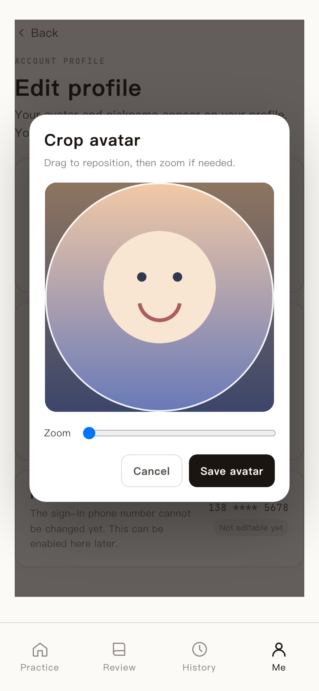

# 对象存储按业务路径归档，并补全头像裁剪与缩略图

- 时间：2026-08-24 18:22:17（北京）

练习资产统一收口到 `practiceSessions/{userId}/{yyyyMM}/{practiceId}/attempts/{n}/`：

- 每轮原声使用独立 `recordingId`，保留浏览器实际上传的 WebM/M4A/OGG/WAV 容器，并在 MongoDB 记录格式、MIME 和大小；评测时临时转为 16kHz 单声道 WAV，不永久保存缺少容器信息的裸 PCM。
- 朗读按 `standard-answer`、`correction`、`example`、`pronunciation-target`、`review` 分目录，点击生成后把资产 key 回写到对应 attempt。例句音频因此不再与纠正句混在通用 `tts/` 目录。
- 路径由后端统一生成，不再由各路由自行拼字符串；月份固定取 session 创建时间。

头像源文件上限从 5 MB 提升到 25 MB。前端新增方形拖动/缩放裁剪，服务端使用 Pillow 重新解码、去 EXIF，并生成同一 `avatarId` 下的 1024 主图与 256 缩略图；资料页默认读取缩略图，替换或恢复默认头像时同时处理两个版本。

新增默认只读的存量迁移工具和「对象存储维护」手动 workflow。生产迁移分为审计、复制并切引用、复验后清理三步；复制校验失败、数据库未引用目标对象或无法关联业务记录时都不会删除旧对象。

验证：后端 316 个测试、前端 314 个测试通过；两端 lint、覆盖率与前端生产构建均通过。生产迁移结果在合并部署后继续记录。
