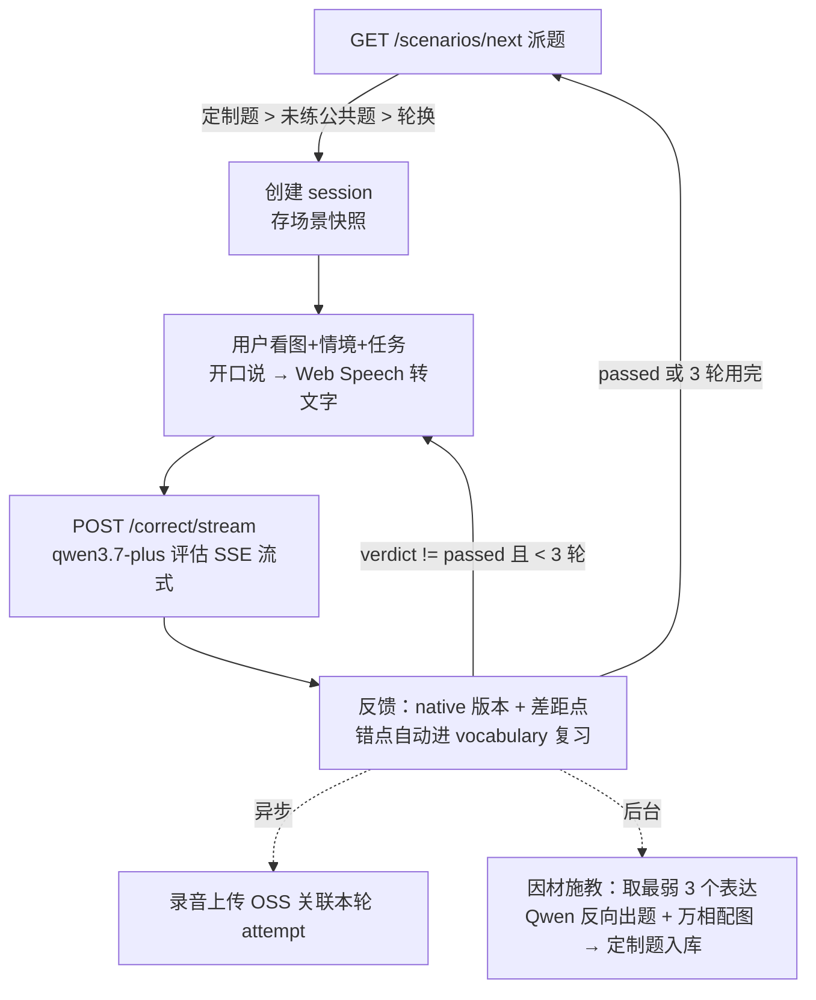

# 场景任务模式 · 总体设计

一页说清当前系统怎么转：流程、模型、存储、后台任务。细节见 [schema.md](schema.md) / [storage.md](storage.md)。

## 练习流程



- 三轮重说：第 2 轮起评估请求自动带上一轮 attempt，模型返回 `progress {verdict: passed/improved/stuck, fixed[], remaining[]}`。
- 定制题（`ownerUserId` + `targetWords`）只派给本人，优先于公共题；每人最多攒 2 道未练的，攒够不再生成。

## 模型清单

| 用途 | 模型 | 接口 | 说明 |
|------|------|------|------|
| 口语评估 / 定制出题 | qwen3.7-plus | compatible-mode (LangChain ChatOpenAI) | 纯文本，评估走 SSE 流式 |
| 场景配图 | wan2.7-image | multimodal-generation 同步接口 | 10~30s 出图，统一写实照片风格后缀 |

模型名与接口地址不写死，走 env：`CHAT_MODEL` / `IMAGE_MODEL` / `DASHSCOPE_BASE_URL`（默认值见 `config.py`，即当前最新版本）。模型版本定期对照 `GET /compatible-mode/v1/models` 用最新的。

## 题库与出图策略

- **公共题**：`server/scripts/generate_scenarios.py` 离线生成——手写场景文案 + imagePrompt → 万相生图 → OSS + `files`/`scenarios` 入库。一题一图一次性成本，全用户复用，按 slug 幂等可重跑。
- **定制题**：评估产生新错点后 `asyncio.create_task` 后台触发，出题+生图全部完成才入库派发，用户永远不等图；失败只记日志。

## 对象存储（阿里云 OSS，私有桶；库里只存 key，读取时现签）

```
scenarios/{scenarioId}/cover.jpg                                    ← 场景图（题目共享资产）
practiceSessions/{userId}/{yyyyMM}/{practiceId}/recording/{ts}.webm ← 每轮录音
```

资源为根、类型做子目录（参考 video-2022）。详见 [storage.md](storage.md)。

## 后台任务与删除

- 进程内异步任务只有一个：定制题生成（`asyncio.create_task`，随评估请求触发）。**没有定时任务/cron**。
- 删除目前都是软删除：`scenarios.status` / `files.status` 置 `archived` 即不再派发，OSS 对象不自动清理。本地自用阶段数据量小，暂不做清理任务；以后做的话方向是离线脚本扫 `archived` 记录批量删 OSS。
