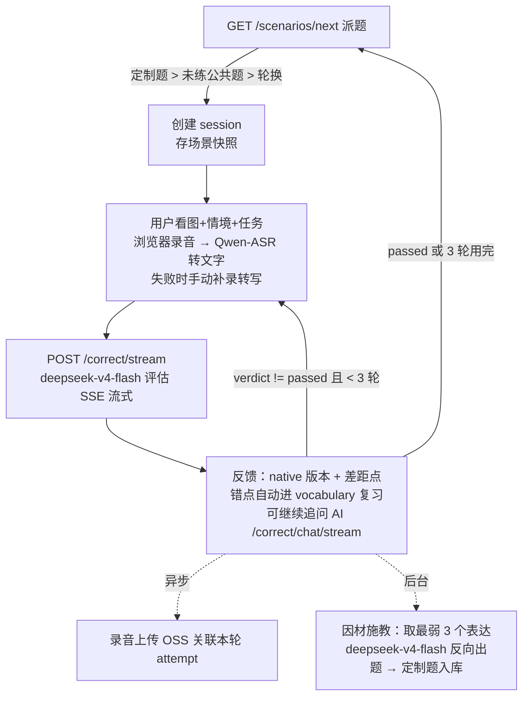

# 场景任务模式 · 总体设计

一页说清当前系统怎么转：流程、模型、存储、后台任务。细节见 [schema.md](../schema.md) / [storage.md](../storage.md)。

## 练习流程



- 三轮重说：第 2 轮起评估请求自动带上一轮 attempt，模型返回 `progress {verdict: passed/improved/stuck, fixed[], remaining[]}`。
- 定制题（`ownerUserId` + `targetWords`）只派给本人，优先于公共题；每人最多攒 2 道未练的，攒够不再生成。

## 场景类型（kind）

题库覆盖 5 类，对齐雅思 Part1/2/3 + 实用口语；每题带 `kind` + `title` + `difficulty`，随机派发不让用户选：

| kind | 对应 | 例子 |
|------|------|------|
| task 办事交涉 | 真实办事 | 咖啡给错单、预约看医生、申请加薪、布置任务、航班改签 |
| chat 日常问答 | 雅思 P1 / 街访 | 介绍家乡、聊手机习惯 |
| describe 描述长谈 | 雅思 P2 / vlog | 难忘旅行、影响你的人、难忘礼物 |
| opinion 观点表达 | 雅思 P3 / 采访 | 远程办公、个人环保 |
| explain 讲解科普 | TED / 科普 | 讲讲春节为什么回家 |

题库离线生成：`server/scripts/generate_scenarios.py`（手写文案 + Seedream 配图）。评估对所有 kind 通用（给地道说法 + 差距），后续可按 kind 调整反馈侧重。

## 模型清单

| 用途 | 模型 | 接口 | 说明 |
|------|------|------|------|
| 口语评估 / 定制出题 / 追问对话 | deepseek-v4-flash（DeepSeek 官方，当前版本 0731） | OpenAI 兼容协议 (LangChain ChatOpenAI) | 当前生产配置；评估走 SSE 流式 |
| 场景配图 | doubao-seedream-5.0-lite（默认关闭 `IMAGE_ENABLED=false`） | 火山方舟 Agent Plan | 原套餐过期期间不自动生新图，旧题图照常使用 |
| 语音识别 / 朗读 | qwen3-asr-flash / qwen3-tts-flash | 阿里云百炼 HTTP | 浏览器音频先统一转 16k mono WAV；云 ASR 失败时可手动补录转写，云 TTS 失败时用浏览器朗读 |

模型名与接口地址不写死，走 env（按能力解耦、不绑运营商）：文字 `CHAT_API_KEY`/`CHAT_BASE_URL`/`CHAT_MODEL`、图片 `IMAGE_*`、语音 `VOICE_PROVIDER`/`VOICE_*`（默认值见 `config.py`）。追问对话端点 `POST /api/correct/chat/stream`：拿场景+本轮反馈作上下文，SSE 流式回答，问答存进对应 attempt 的 `chat` 数组。

## 题库与出图策略

- **公共题**：`server/scripts/generate_scenarios.py` 离线生成——手写场景文案 + imagePrompt → Seedream 生图 → OSS + `files`/`scenarios` 入库。一题一图一次性成本，全用户复用，按 slug 幂等可重跑。
- **定制题**：评估产生新错点后 `asyncio.create_task` 后台触发，出题+生图全部完成才入库派发，用户永远不等图；失败只记日志。

## 对象存储（阿里云 OSS，私有桶；库里只存 key，读取时现签）

```
scenarios/{scenarioId}/cover.jpg                                    ← 场景图（题目共享资产）
practiceSessions/{userId}/{yyyyMM}/{practiceId}/attempts/{n}/recordings/{recordingId}/original.{ext} ← 每轮原声
```

资源为根、类型做子目录（参考 video-2022）。详见 [storage.md](../storage.md)。

## 后台任务与删除

- 进程内异步任务只有一个：定制题生成（`asyncio.create_task`，随评估请求触发）。**没有定时任务/cron**。
- 删除目前都是软删除：`scenarios.status` / `files.status` 置 `archived` 即不再派发，OSS 对象不自动清理。本地自用阶段数据量小，暂不做清理任务；以后做的话方向是离线脚本扫 `archived` 记录批量删 OSS。
