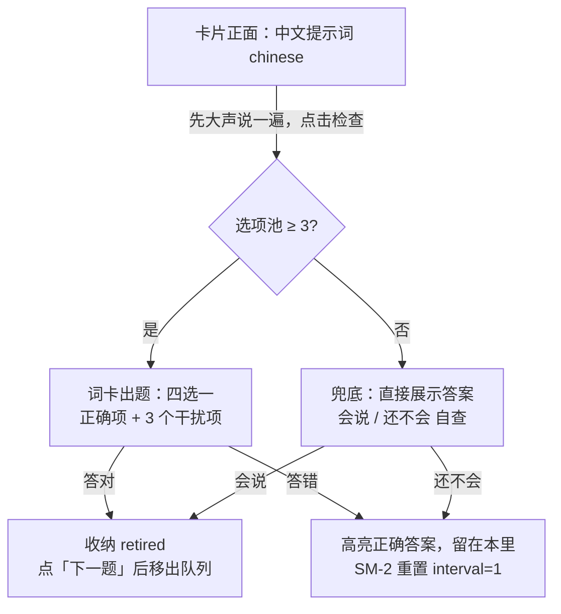

# 错题本与复习（当前实现）

> 本文档基于当前源码状态维护，描述**已实现**的行为。改动复习相关功能时，必须同步更新本文（见 CONTRIBUTING「文档维护」）。
> 数据模型以 [design/schema.md](../design/schema.md) 的 `reviewItems` 集合为准；混合练习（新旧题混排、6.5 收纳）仍为设计稿，见 [design/mixed-practice.md](../design/mixed-practice.md)。

## 一句话定位

练习中被纠正的表达沉淀进错题本；复习时用**中文提示词主动回忆 + 词卡出题**检验，会说即收纳，不再重复出现。

## 复习项的两类来源（kind）

| kind | 名称 | 来源 | 说明 |
|------|------|------|------|
| `mistake` | 错题 | 纠错反馈的 gap（AI 自动收录 `saveToReview=true`，或反馈页手动「加入复习」） | 存 `original`（用户当时的错误说法，仅留档，**复习 UI 不展示**） |
| `note` | 好表达笔记 | 反馈页标准答案卡「记为笔记」按钮（整句收录 `standardAnswer`） | 用户主动记的地道表达，没有错误版本 |

规则：

- 历史数据无 `kind` 字段 → 一律按 `mistake` 归一（后端 list 时处理）。
- 同一 `expression` 去重：重复收录返回已有 id（前端支持再点一下取消）。
- 记过笔记的表达**又说错**（correct 收录命中同表达）→ 自动升级为 `mistake` 并补记 `original`。

## 复习卡流程（`/review`，ReviewPage）

要点：

- **主动回忆**：正面只有中文提示词（`chinese`，即 expression 的中文翻译，词/短语/句子皆可），不展示英文答案，更不展示用户错误版本。
- **词卡出题（温故而知新）**：干扰项取自该用户自己的其它复习项（含已收纳项）的 expression，去重后随机 3 个；选项池不足 3 个时退化为「直接看答案 + 会说/还不会自查」。
- **答对即收纳**：`POST /{rid}/review {remembered: true}` → `status=retired`（`retiredBy=self`），复习队列、底部 tab 待复习角标（`due=true` 查询）、因材施教出题取材全部排除 retired。
- **答错留本**：`remembered: false` → `interval` 重置为 1 天、`easiness-0.3`，第二天继续出现。
- 卡片与列表均提供「用这个词练一题」：针对该表达即时生成定制场景题（`POST /api/scenarios/practice-word`），让用户在新场景里用上它说新句子。

### 中文提示词（chinese）来源

| 场景 | 来源 |
|------|------|
| 新收录的错题 | corrector 纠错时随 gap 产出（prompt 要求每个 gap 带 `chinese`），自动/手动收录都落库 |
| 新收录的笔记 | 当时不产出，首次复习时惰性翻译 |
| 历史数据 | 首次刷到该卡时前端调 `POST /api/review-items/{rid}/translate` 惰性翻译补齐并落库（复用 CHAT 模型，走 LLM 审计 kind=review_translate）；翻译失败则卡片降级为「直接点击查看答案」 |

## 错题本页面结构

- **卡片视图（默认首屏）**：顶部「全部 / 错题 / 笔记」过滤 chips（带计数）；卡片正面左上角有类别标签。
- **列表视图**：按「错题 · N」「笔记 · N」分组展示；底部「已收纳 N」折叠区，可展开查看、单条恢复（`POST /{rid}/restore`，恢复后立即可复习）。
- **完成页**：本轮结束后展示待复习数与「本轮收纳 N 条」；「再来一遍」重新拉取。
- 已收纳的表达再次说错 → 自动重新激活回错题本（重置调度字段，`retiredAt/retiredBy` 清除）。

## API 一览（/api/review-items）

| 路由 | 方法 | 说明 |
|------|------|------|
| `/api/review-items` | POST | 收录（items 支持 `kind`，非法/缺省归 `mistake`；retired 重复收录自动激活） |
| `/api/review-items?userId=&due=&includeRetired=` | GET | 列表；默认排除 retired，`due=true` 只返回到期项（tab 角标用）；返回时 `kind` 归一 |
| `/api/review-items/{rid}/review` | POST | `{remembered}`：true=收纳，false=SM-2 重置 |
| `/api/review-items/{rid}/restore` | POST | 已收纳项恢复为 active 且立即可复习 |
| `/api/review-items/{rid}/translate` | POST | 缺 chinese 时惰性翻译并落库，返回 `{chinese}` |
| `/api/review-items/{rid}` | DELETE | 删除（两次确认交互在前端） |
| `/api/scenarios/practice-word` | POST | 「用这个词练一题」即时出定制场景题 |

## 前端文件索引

| 文件 | 职责 |
|------|------|
| `web/src/pages/ReviewPage.jsx` | 复习页：卡片/列表视图、kind 过滤、词卡出题、收纳/恢复、惰性翻译触发 |
| `web/src/pages/useReviewCollection.js` | 练习页收录 hook：gap 收录/取消 + 标准答案记笔记 |
| `web/src/components/practice/PracticeFeedbackView.jsx` | 反馈页：gap「加入复习」按钮、标准答案「记为笔记」按钮 |
| `web/src/components/layout/Layout.jsx` | 底部 tab 待复习角标（`listReviewItems(userId, due=true)`） |

## 测试覆盖

- 后端 `tests/integration/test_review_items.py`：收录去重/kind 归一/收纳/恢复/重新激活/惰性翻译/越权。
- 后端 `tests/integration/test_correct.py`：自动收录落 mistake、笔记升级为错题、retired 重新激活。
- 前端 `ReviewPage.test.jsx`：中文提示卡、错误版本不展示、词卡出题（答对收纳/答错留本/选项池不足兜底）、kind 过滤与分组、已收纳区恢复。
- 前端 `PracticePage.feedback.test.jsx`：标准答案记笔记/取消。
